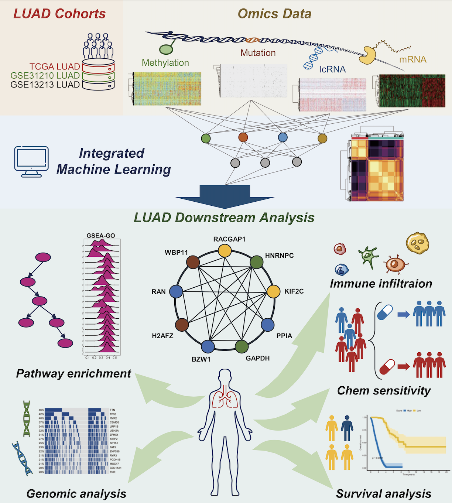

## Reproducible Scripts for LUAD Analysis**

### This repository contains R scripts that reproduce the results presented in the study: "Integrating Machine Learning and Multiomic Data for Molecular Typing and Prognosis Prediction in Lung Adenocarcinoma (LUAD)."**

These scripts detail the comprehensive workflow for analyzing lactylation-related genes (LRGs) in LUAD, including data preprocessing, multiomics subtyping, prognostic model construction, and immune and therapeutic response analyses.





### Workflow Overview

The analysis pipeline is structured into the following key steps, each corresponding to a script in the repository:

1. **Data Preprocessing (`01_Data_cleaning.R`)**
   - Prepares multiomic data, including transcriptome (mRNA and lncRNA), DNA methylation, and somatic mutation datasets, from TCGA, UCSC-XENA, and GEO databases (e.g., GSE31210 and GSE13213).
   - Processes somatic mutation data using the `maftools` package and formats clinical data for downstream analysis.

2. **Clustering Analysis (`02_Clustering.R`)**
   - Performs multiomics subtyping using the `MOVICS` package.
   - Integrates clustering results from 10 algorithms (e.g., ConsensusClustering, SNF, CIMLR) to identify lactylation cancer subtypes (CSs).

3. **Pathway and Gene Set Enrichment Analysis (`03_GSVA.R`, `05_ssGSEA.R`)**
   - Performs pathway enrichment and scoring using the `GSVA` and `ssGSEA` methods.
   - Annotates subtype-specific pathways using curated databases (e.g., KEGG, HALLMARK).

4. **Principal Component Analysis (`04_PCA.R`)**
   - Visualizes subtype differences using PCA on multiomic data.

5. **Immune Cell Infiltration Analysis (`06_IBOR_immune_infiltration.R`)**
   - Assesses immune activity using the `IOBR` package with multiple deconvolution algorithms (e.g., MCPcounter, TIMER).
   - Compares immune characteristics across subtypes and risk groups.

6. **Gene Selection and Feature Prioritization (`07_Gene_selection.R`)**
   - Identifies LRGs with significant differential expression and prognostic relevance.
   - Uses the `MOVICS` and `limma` packages to filter genes with a p-value < 0.01.

7. **Machine Learning Model Construction (`08_Machine_learning.R`)**
   - Constructs a robust prognostic model using nine hub LRGs with 10 machine learning algorithms (e.g., CoxBoost, Lasso, Random Survival Forest).
   - Outputs high- and low-risk patient groups based on risk scores.

8. **Clinical and Prognostic Associations (`09_SCORE_clinical_association.R`)**
   - Correlates high- and low-risk groups with clinical features, including tumor stage and metastasis.
   - Validates survival predictions using Kaplan-Meier and ROC analyses.

9. **Pathway and Oncogenic Enrichment (`10_Multiple_regression.R`, `11_RS_enrichment.R`)**
   - Performs regression analyses to link pathways and genes to risk groups.
   - Identifies enriched oncogenic pathways in high- and low-risk patients using GSEA.

10. **Additional Molecular Features (`12_Stemness_TMB_MSI.R`)**
    - Analyzes tumor mutational burden (TMB), microsatellite instability (MSI), and stemness indices across subtypes.

11. **Tumor Microenvironment Analysis (`13_Microenvironment.R`)**
    - Profiles immune and stromal components in the tumor microenvironment and links them to risk groups.

12. **Chemokine and Drug Resistance Scores (`14_Chemokines_score.R`, `16_Drug_resistence_score.R`)**
    - Calculates chemokine activity scores and evaluates drug resistance predictions using the `oncoPredict` package.

13. **Mutation Analysis (`17_Categorized_mutation_comparison.R`)**
    - Visualizes mutation differences between risk groups using `maftools`.
    - Maps somatic mutations in high- and low-risk patients.

---

### **How to Reproduce the Analysis**

1. **Clone the Repository**:

2. **Install Required R Packages**:
   ```R
   install.packages(c("MOVICS", "maftools", "GSVA", "IOBR", "TIDE", "oncoPredict", 
                      "survminer", "ggplot2", "clusterProfiler", "limma", "patchwork"))
   ```

3. **Run Scripts**:
   Follow the logical order of the scripts listed above to reproduce each step of the analysis:
   - Start with `01_Data_cleaning.R` for data preprocessing.
   - Proceed to clustering (`02_Clustering.R`), pathway enrichment (`03_GSVA.R`), and immune analysis (`06_IBOR_immune_infiltration.R`).
   - End with prognostic modeling (`08_Machine_learning.R`) and mutation analysis (`17_Categorized_mutation_comparison.R`).
   
4. **Data**: Any data produced during this pipeline is available upon request.


---

### **Directory Structure**
| Script Name                      | Description                                         |
|----------------------------------|-----------------------------------------------------|
| `01_Data_cleaning.R`             | Data preprocessing and cleaning.                   |
| `02_Clustering.R`                | Multiomics clustering and subtype analysis.         |
| `03_GSVA.R`, `05_ssGSEA.R`       | Pathway scoring and enrichment analyses.            |
| `04_PCA.R`                       | PCA for subtype visualization.                     |
| `06_IBOR_immune_infiltration.R`  | Immune cell infiltration analysis.                 |
| `07_Gene_selection.R`            | LRG selection and prioritization.                  |
| `08_Machine_learning.R`          | Prognostic model construction using machine learning. |
| `09_SCORE_clinical_association.R`| Clinical correlation analysis.                     |
| `10_Multiple_regression.R`       | Regression analyses for pathways and genes.        |
| `11_RS_enrichment.R`             | Risk group enrichment analysis.                    |
| `12_Stemness_TMB_MSI.R`          | Analysis of TMB, MSI, and stemness indices.        |
| `13_Microenvironment.R`          | Tumor microenvironment profiling.                  |
| `14_Chemokines_score.R`          | Chemokine activity scoring.                        |
| `16_Drug_resistence_score.R`     | Drug resistance predictions.                       |
| `17_Categorized_mutation_comparison.R` | Mutation analysis and visualization.             |

---

### **Contact**
For questions or issues, please contact [Tao Li] at [Qllitao@126.com].

